# 一、系统说明

基于springboot+elementui开发的校园闲置物品交易系统,系统功能齐全, 代码简洁易懂，适合小白学编程。

# 二、系统架构

######      前端：vue| elementui

######      后端：springboot | mybatis 

######      环境：jdk1.8+ | mysql8.0 | maven

# 三、代码及数据库

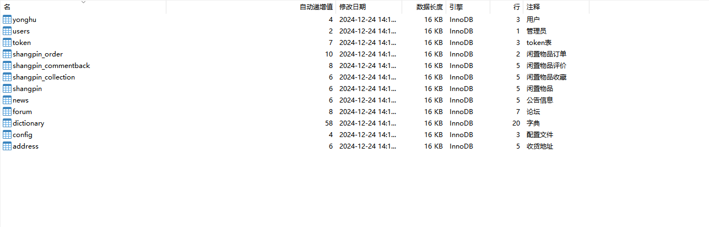

# 四、相关功能介绍

#### 1).客户端

###### 1.登录
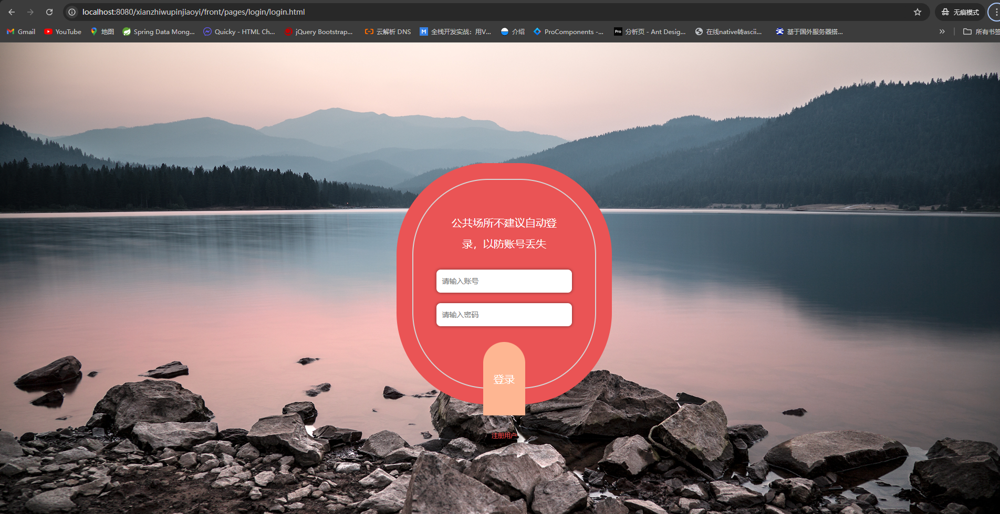

###### 2.注册

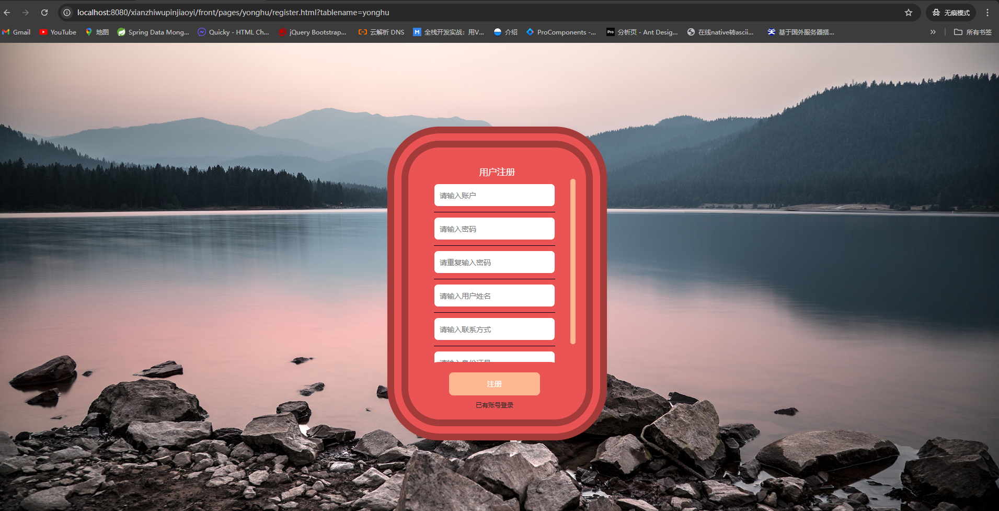

###### 3.首页

###### 4.论坛

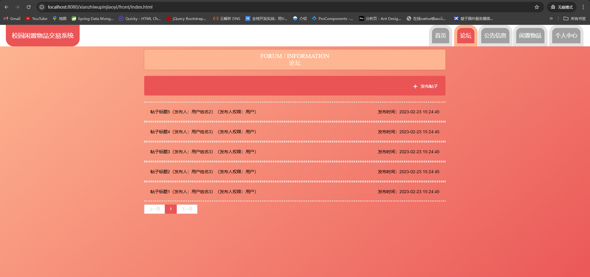

5.公告

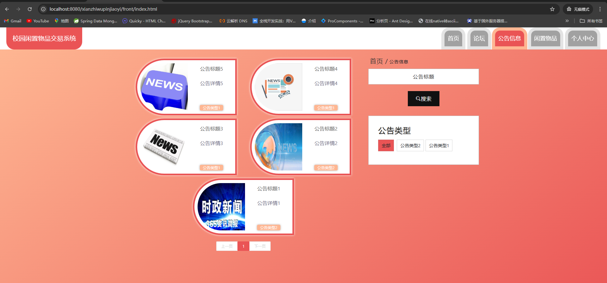

###### 6.闲置物品

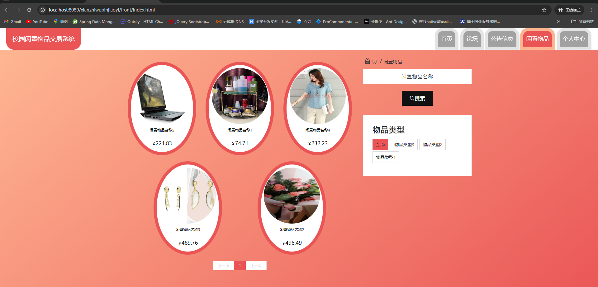

###### 7.个人中心

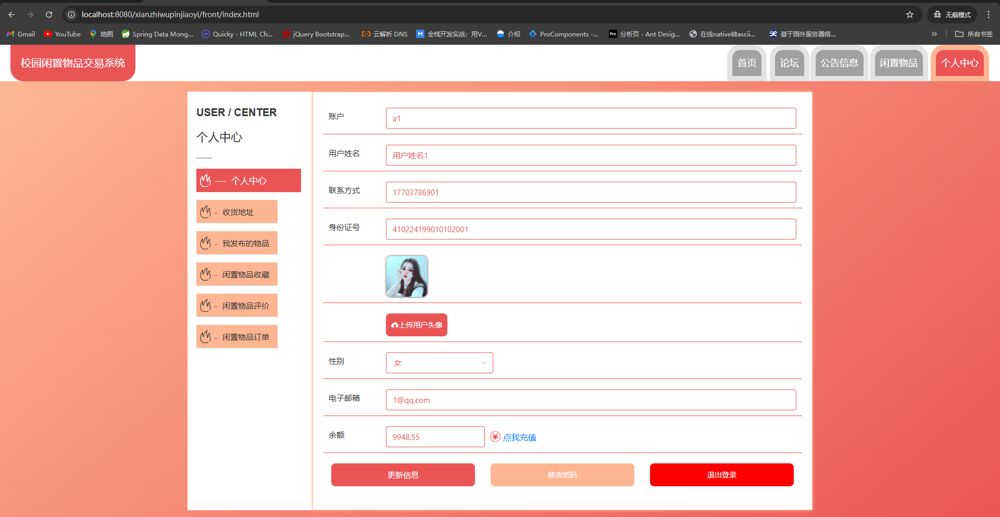

###### 8.个人中心->收货地址

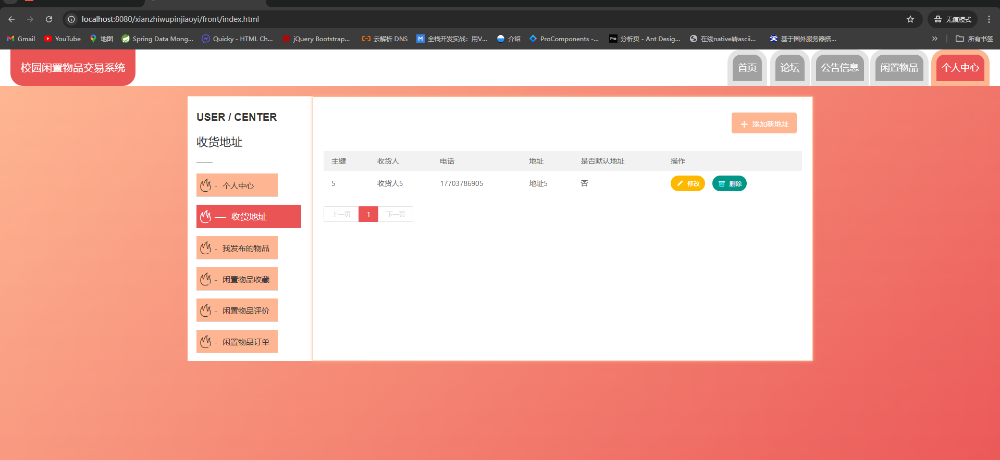

###### 9.个人中心->我发布的物品

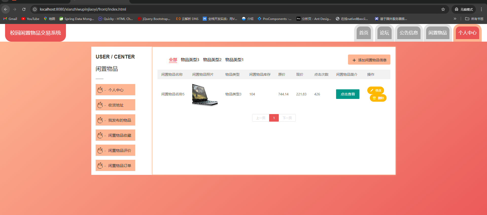

###### 10.个人中心->发布物品

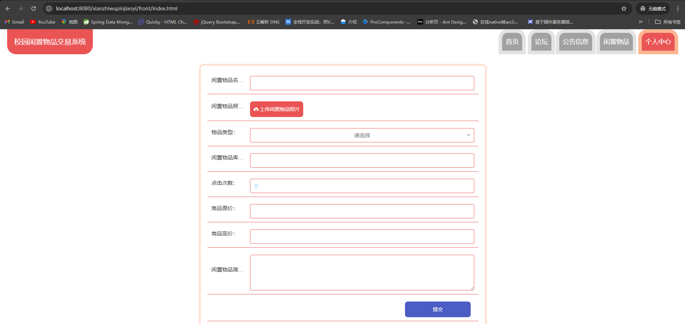

###### 11.个人中心->闲置物品评价

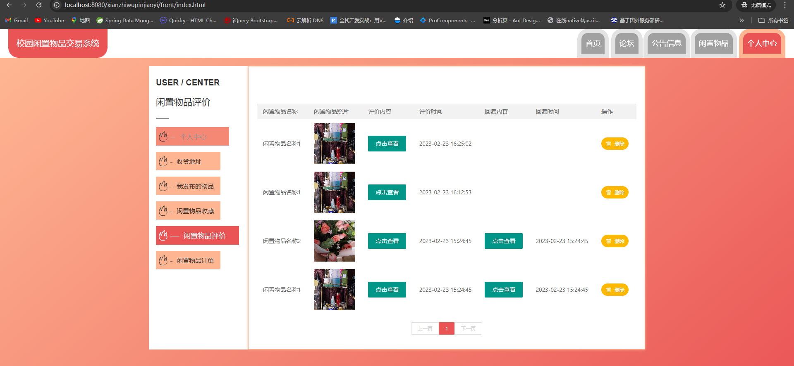

###### 12.个人中心->闲置物品订单

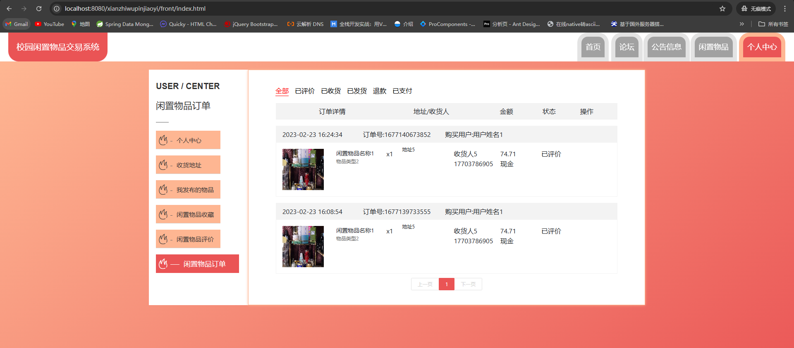

###### 2).管理端

###### 1.登录

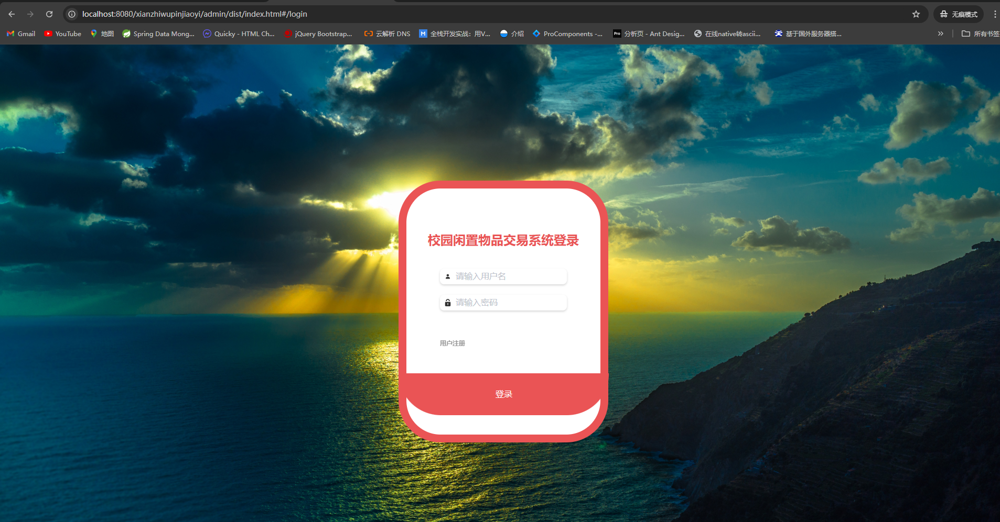

###### 2.用户注册

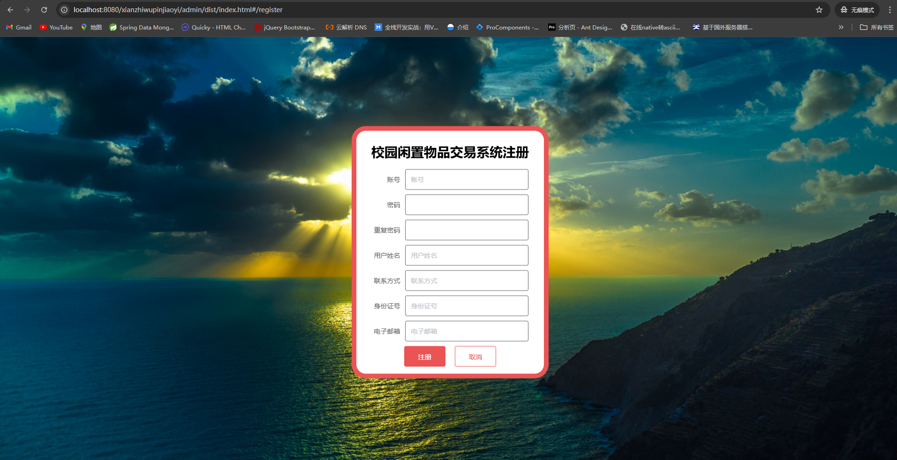

###### 3.管理员信息

###### 4.个人中心->修改密码

###### 5.论坛管理

包含:修改、详情、查看论坛回复、删除帖子

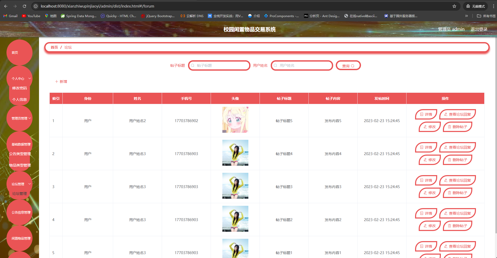

###### 6.公告信息管理

包含:新增、详情、删除、查询功能

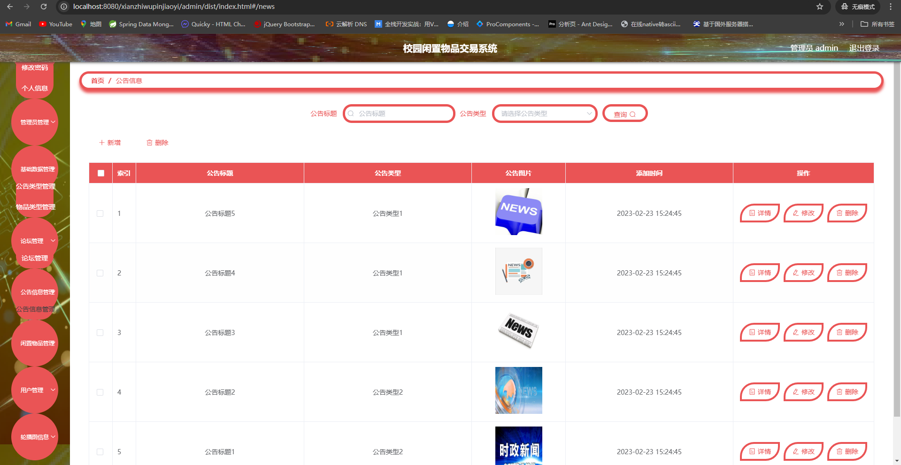

###### 7.闲置物品管理

包含:新增、修改、详情、删除、下架

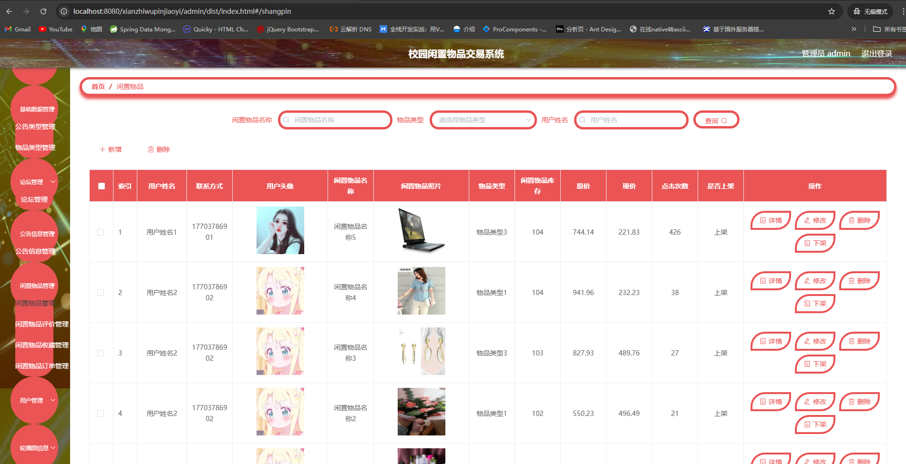

###### 8.闲置物品管理->闲置物品评价

包含:详情、删除、查询功能

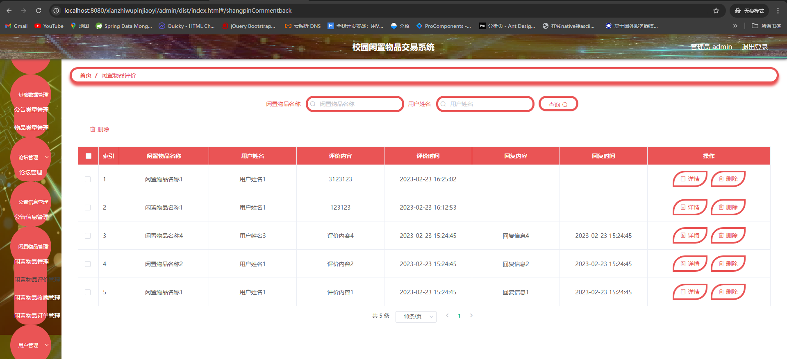

###### 9.闲置物品管理->闲置物品收藏

包含:详情、删除、查询功能

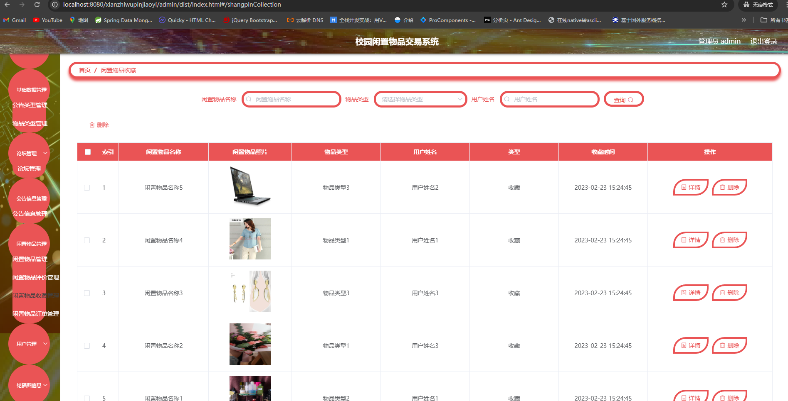

###### 10.闲置物品管理->闲置物品订单

包含:详情、删除、查询功能

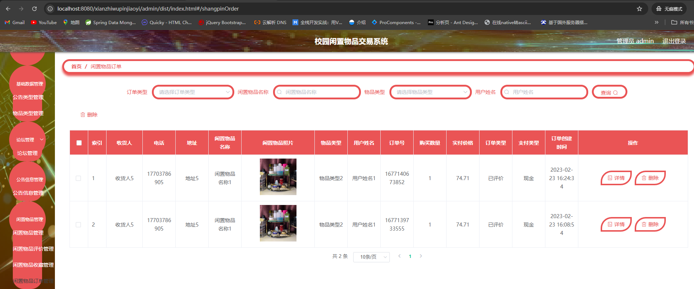

###### 11.用户管理

包含:详情、删除、查询、修改、重置密码功能

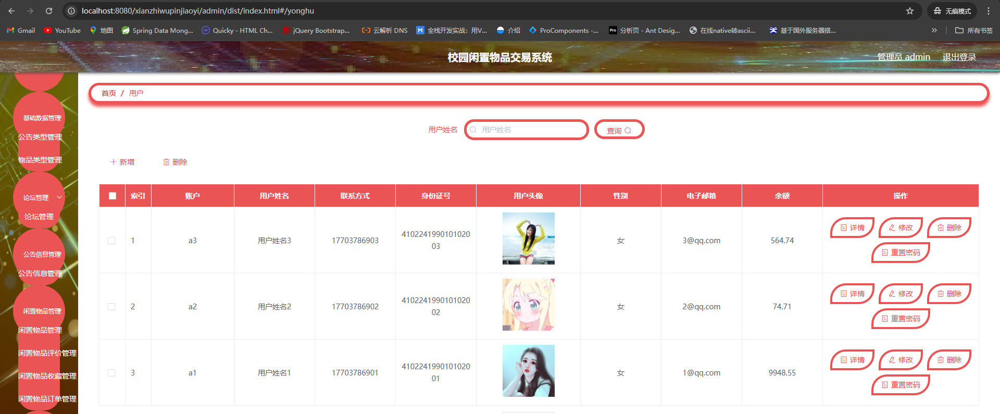

###### 12.轮播图管理

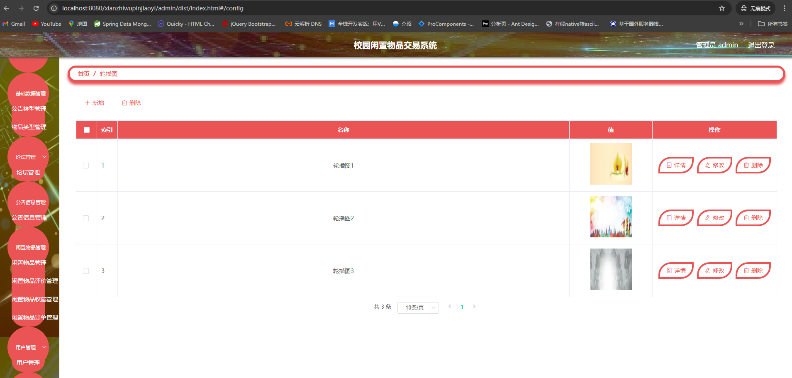

######
